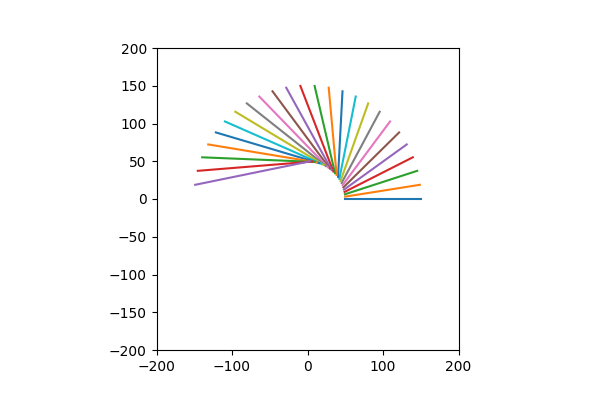
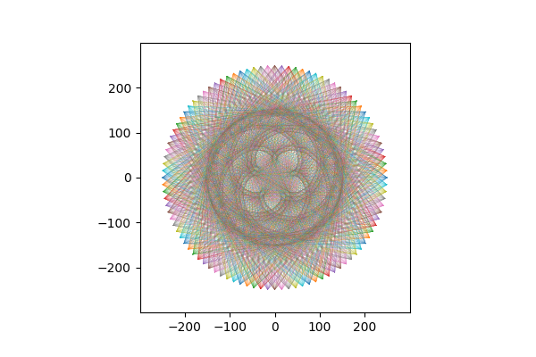
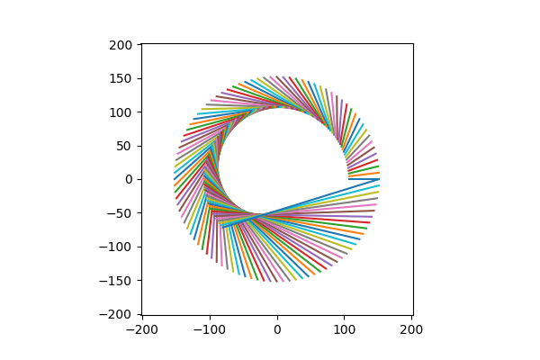
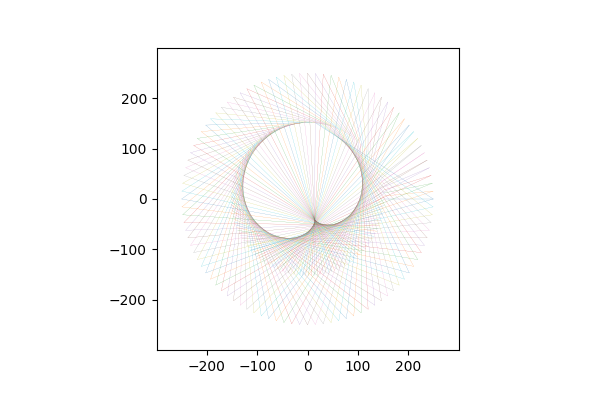
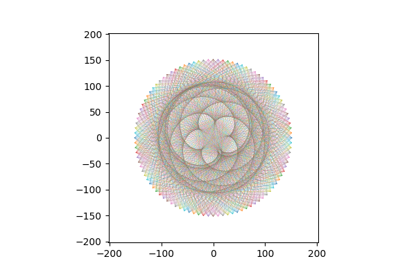
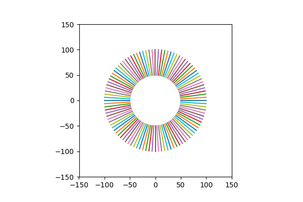

# What is about?

Inspired by a Pinterest post on what joining 2 planets' positions over several years looks like, I wrote this code to verify it.

`lines.ipynb` contains all the tunabke parameters.

```
pl1_rad = radius of planet with smaller orbit

pl2_rad = radius of the other planet

fraction = ratio of revolutionary periods of 1 and 2 in earth years

outer_turn_angle = number of revolutions of outer planet to consider in the plot

one_round_steps = steps to consider in one revolution. 100 gives a good plot.

figname = output figure name

linewidth = linewidth (points) for each line in the plot
```

This code considers circular orbits for both planets. It can be modified for elliptical orbits by using (`a cosθ`, `b sinθ`) instead of (`r cosθ`, `r sinθ`) while plotting the coordinates.

This code also considers that both planets start from angle 0. This may not always be the case, but its effects dilute with more number of turns (i.e. a higher outer_turn_angle).
<br><br><br>

Some of the plots:
<br><br>

<p style="text-align: center;">


half a plot for testing
<br><br><br>


plot for mars and earth over 32 years<br>
(32*2*pi in place of outer_turn_angle)
<br><br><br>


plot for venus and earth over 1 year
<br><br><br>


plot for venus and earth over 2 years
<br><br><br>


plot for venus and earth over 8 years
<br><br><br>


plot for 2 planets with same revolutionary period